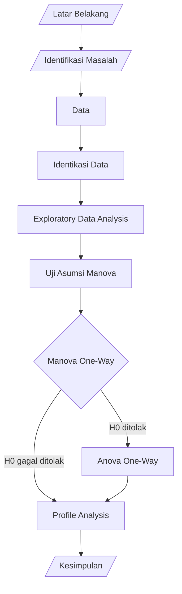

# Multivariate Analysis


> **Disclaimer :**
> 
> This project is for educational purposes.

## Alur Berfikir ##


## Pendahuluan ##
### Latar Belakang ###
1. Pada era digital, dibutuhkan **aspek pendukung**, salah satunya pemograman dan *coding*.
2. Dalam *coding* dibutuhkan aspek pendukung, diantaranya **konsentrasi dan pemikiran kritis**.
3. Salah satu penyebab dari kurangnya konsentrasi pada manusia adalah **kurangnya waktu tidur**.
4. Ditemukan *coder* sering kali **tidur larut malam (begadang)** untuk menyelesaikan pekerjaannya.
5. Penelitian McKinsey & Company menunjukkan **korelasi antara kurangnya tidur dengan menurunnya efisiensi kerja**.
6. Akibat dari kurangnya waktu tidur, berpengaruh terhadap **performa *coder* dalam coding**.

### Rumusan Masalah ###
1. Apakah terdapat **perbedaan rata-rata performa dalam *coding*** antara mahasiswa yang tidur normal dengan yang *deprived* (kurang tidur)?
2. Jika terdapat **perbedaan rata-rata performa dalam *coding***, perbedaan **variabel performa** dalam *coding* manakah yang **berbeda secara signifikan**?
3. Apakah terdapat **perbedaan *profile*** antara mahasiswa yang tidur normal dengan yang *deprived* (kurang tidur) terhadap performa dalam *coding*?

## Data ##
[Data](https://calmcode.io/datasets/sleep.html) ini merupakan data hasil tes dari 30 mahasiswa universitas (diketahui nilai GPA) yang mana menerapkan **kelas “PigLatin”** selama 90 menit, dimana diberikan perlakuan, yaitu pada malam sebelum tes beberapa mahasiswa tidur normal dan beberapa lainnya deprived (kurang tidur). Berikut **unit tes** yang digunakan:
- Passed Unit Test
- Passed Assert
- Tackled User Stories

Definisi dari setiap variabel adalah sebagai berikut.

| Variabel | Tipe Data | Definisi |
| :--- | :---: | :--- |
| Sleep | Faktor | Durasi tidur (normal dan *deprived*/kurang tidur) |
| GPA | Numerik | Nilai rata-rata mahasiswa di Italia |
| Passed Unit Test | Numerik | Banyaknya unit tes yang lulus setelah diuji kembali |
| Passed Assert | Numerik | Banyaknya unit tes yang diketahui lulus |
| Tackled User Stories | Numerik | Banyaknya user stories yang ditangani |

## Exploratory Data Analysis ##
### Data ###
```
tibble [30 x 5] (S3: tbl_df/tbl/data.frame)
 $ sleep               : Factor w/ 2 levels "deprived","normal": 2 2 2 2 2 2 2 2 2 2 ...
 $ gpa                 : num [1:30] 23 23 28 25 28 23 22 26 24 22 ...
 $ passed_unit_tests   : num [1:30] 5 7 5 4 4 4 4 1 4 4 ...
 $ passed_asserts      : num [1:30] 6 6 8 5 5 5 5 6 4 5 ...
 $ tackled_user_stories: num [1:30] 5 5 4 3 3 3 3 2 3 3 ...
```

**Sleep: Normal**
```
      sleep         gpa       passed_unit_tests passed_asserts  tackled_user_stories
 deprived: 0   Min.   :20.0   Min.   :0.0       Min.   :4.000   Min.   :1.0         
 normal  :15   1st Qu.:22.5   1st Qu.:3.5       1st Qu.:5.000   1st Qu.:3.0         
               Median :24.0   Median :4.0       Median :5.000   Median :3.0         
               Mean   :24.2   Mean   :3.8       Mean   :5.667   Mean   :3.2         
               3rd Qu.:25.5   3rd Qu.:4.5       3rd Qu.:6.000   3rd Qu.:3.5         
               Max.   :28.0   Max.   :7.0       Max.   :8.000   Max.   :5.0 
```

**Sleep: Deprived**
```
      sleep         gpa       passed_unit_tests passed_asserts  tackled_user_stories
 deprived:15   Min.   :22.0   Min.   :0.000     Min.   :2.000   Min.   :0.0         
 normal  : 0   1st Qu.:23.0   1st Qu.:0.000     1st Qu.:2.000   1st Qu.:1.0         
               Median :24.0   Median :1.000     Median :3.000   Median :2.0         
               Mean   :24.4   Mean   :1.133     Mean   :3.267   Mean   :1.6         
               3rd Qu.:25.5   3rd Qu.:1.000     3rd Qu.:4.000   3rd Qu.:2.0         
               Max.   :28.0   Max.   :7.000     Max.   :6.000   Max.   :5.0 
```

### Box Plot ###
<p align="center">
  
  <br>
  <i>Gambar 1 Box Plot</i>
</p>

Berdasarkan hasil plot di atas, dapat disimpulkan sebagai berikut.
1. **Variabel GPA**, dapat dikatakan **relatif sama** antara mahasiswa yang tidur normal dengan yang *deprived**.
2. **Variabel Passed Unit Test, Passed Assets, dan Tackled User Stories**, dapat dikatakan **cukup berbeda signifikan** antara mahasiswa yang tidur normal dengan yang *deprived*.

## Uji Asumsi Manova ##
### 1. Asumsi Multivariat Normal ###
Menggunakan MShapiro-Wilk

**Hipotesis:**

$H_0$ : Data berdistribusi Multivariat Normal

$H_1$ : Tidak demikian

**Statistik Uji:**
```
	Shapiro-Wilk normality test

data:  Z
W = 0.93358, p-value = 0.06115
```

**Kesimpulan:**

Dengan $\alpha = 0.05$, dapat disimpulkan bahwa **data berdistribusi Multivariat Normal**

### 2. Asumsi Homogenitas ###
Menggunakan BoxM

**Hipotesis:**

$H_0$ : $\Sigma_1 = \Sigma_2$

$H_1$ : Tidak demikian

**Statistik Uji:**
```
$Chisq
[1] 8.442269

$df
[1] 10

$p.value
[1] 0.5857202

$Test
[1] "BoxM"

attr(,"class")
[1] "MVTests" "list" 
```

**Kesimpulan:**

Dengan $\alpha = 0.05$, dapat disimpulkan bahwa **matriks varians-kovarians berasal dari populasi homogen**.

### 3. Asumsi Independen ###
Sampel yang terdapat pada data ini diambil secara random, maka dapat dikatakan bahwa **asumsi independen terpenuhi**.

### 4. Asumsi Outlier ###
Dengan menggunakan *Mahalobins distance*, dapat disimpulkan bahwa **tidak terdapat data yang extreme outlier**.
```
[1] gpa                  passed_unit_tests    passed_asserts       tackled_user_stories
[5] mahal.dist           is.outlier          
<0 rows> (or 0-length row.names)
```

### 5. Asumsi Multikolinearitas ###
Dengan menggunakan uji korelasi Pearson didapatkan nilai $𝑝 − 𝑣𝑎𝑙𝑢𝑒 < 0.05$ , sehingga dapat disimpulkan bahwa **tidak terjadi gejala multikolinieritas pada data**.
```
# A tibble: 16 x 8
   var1                 var2                  cor statistic         p conf.~1 conf.~2 method
   <chr>                <chr>               <dbl>     <dbl>     <dbl>   <dbl>   <dbl> <chr> 
 1 gpa                  gpa                 1       2.51e+8 1.73e-216   1       1     Pears~
 2 gpa                  passed_unit_tests  -0.07   -3.70e-1 7.14e-  1  -0.419   0.298 Pears~
 3 gpa                  passed_asserts      0.062   3.29e-1 7.45e-  1  -0.305   0.413 Pears~
 4 gpa                  tackled_user_stor~ -0.12   -6.23e-1 5.38e-  1  -0.458   0.254 Pears~
 5 passed_unit_tests    gpa                -0.07   -3.70e-1 7.14e-  1  -0.419   0.298 Pears~
 6 passed_unit_tests    passed_unit_tests   1       3.55e+8 1.06e-220   1       1     Pears~
 7 passed_unit_tests    passed_asserts      0.53    3.32e+0 2.52e-  3   0.212   0.748 Pears~
 8 passed_unit_tests    tackled_user_stor~  0.95    1.54e+1 3.62e- 15   0.887   0.974 Pears~
 9 passed_asserts       gpa                 0.062   3.29e-1 7.45e-  1  -0.305   0.413 Pears~
10 passed_asserts       passed_unit_tests   0.53    3.32e+0 2.52e-  3   0.212   0.748 Pears~
11 passed_asserts       passed_asserts      1     Inf       0           1       1     Pears~
12 passed_asserts       tackled_user_stor~  0.56    3.57e+0 1.31e-  3   0.250   0.765 Pears~
13 tackled_user_stories gpa                -0.12   -6.23e-1 5.38e-  1  -0.458   0.254 Pears~
14 tackled_user_stories passed_unit_tests   0.95    1.54e+1 3.62e- 15   0.887   0.974 Pears~
15 tackled_user_stories passed_asserts      0.56    3.57e+0 1.31e-  3   0.250   0.765 Pears~
16 tackled_user_stories tackled_user_stor~  1     Inf       0           1       1     Pears~
# ... with abbreviated variable names 1: conf.low, 2: conf.high
```

## Manova One-Way ##
**Hipotesis:**

$H_0$ : $\mu_1 = \mu_2$

$H_1$ : Tidak demikian

**Statistik Uji:**
| Statistik Uji | Nilai Statistik Uji | p-value | Keputusan |
| :--- | :---: | :---: | :---: |
| Wilks' $\Lambda$ | 0.44794 | 0.0003451 | $H_0$ ditolak |
| Lawley-Hotelling $U^{(s)}$ | 0.55206 | 0.0003451 | $H_0$ ditolak |
| Pillai's $V^{(s)}$ | 0.55206 | 0.0003451 | $H_0$ ditolak |
| Roy's Largest Root | 1.2324  | 0.0003451 | $H_0$ ditolak |

**Kesimpulan:**

Dengan $\alpha = 0.05$, maka dapat disimpulkan bahwa **terdapat perbedaan mean performa dalam *coding*** antara mahasiswa yang tidur normal dengan yang *deprived* (kurang tidur).

## Anova One-Way ##
**Hipotesis:**

$H_0$ : $\mu_{1i} = \mu_{2i}$

$H_1$ : Tidak demikian

**Statistik Uji:**
| Variabel Dependen | Nilai Statistik Uji | p-value | Keputusan |
| :--- | :---: | :---: | :---: |
| GPA | 0.44794 | 0.8041 | $H_0$ ditolak |
| Passed Unit Test | 14.07  | 0.0008157 | $H_0$ ditolak |
| Passed Assert | 26.144 | 2.036e-05 | $H_0$ ditolak |
| Tackled User Stories | 12.8  | 0.001287 | $H_0$ ditolak |

**Kesimpulan:**

Dengan $\alpha = 0.05$, maka dapat disimpulkan bahwa untuk **variabel GPA tidak terdapat perbedaan mean** antara mahasiswa yang tidur normal dengan yang *deprived* (kurang tidur), sedangkan **tiga variabel lainnya, terdapat perbedaan mean**, dimana **passed unit test dan passed assert** berbeda sangat signifikan.

## Profile Analysis ##
<p align="center">
  
  <br>
  <i>Gambar 2 Profile Analysis</i>
</p>

### 1. Akan diuji apakah profile paralel ###
**Hipotesis:**

$H_{01}$ : Profile dari kedua *treatment* paralel

**Statistik Uji:**
| Statistik Uji | Nilai Statistik Uji | p-value | Keputusan |
| :--- | :---: | :---: | :---: |
| Wilks' $\Lambda$ | 0.5333352 | 0.0008393305 | $H_0$ ditolak |
| Lawley-Hotelling $U^{(s)}$ | 0.4666648 | 0.0008393305 | $H_0$ ditolak |
| Pillai's $V^{(s)}$ | 0.8749934  | 0.0008393305 | $H_0$ ditolak |
| Roy's Largest Root | 0.8749934   | 0.0008393305 | $H_0$ ditolak |

**Kesimpulan:**

Dengan $\alpha = 0.05$, maka dapat disimpulkan bahwa **profile** antara mahasiswa yang tidur normal dengan yang *deprived* (kurang tidur) **tidak paralel**.

### 2. Akan diuji apakah level profile sama ###
**Hipotesis:**

$H_{02}$ : Profile dari kedua *treatment* memiliki level yang sama

**Statistik Uji:**
```
            Df Sum Sq Mean Sq F value   Pr(>F)    
group        1  19.60  19.602   17.59 0.000249 ***
Residuals   28  31.21   1.115                     
---
Signif. codes:  0 ‘***’ 0.001 ‘**’ 0.01 ‘*’ 0.05 ‘.’ 0.1 ‘ ’ 1
```

**Kesimpulan:**

Dengan $\alpha = 0.05$, maka dapat disimpulkan bahwa **profile** antara mahasiswa yang tidur normal dengan yang *deprived* (kurang tidur) **memiliki level yang berbeda**.

### 3. Akan diuji apakah profile flat ###
**Hipotesis:**

$H_{03}$ : Profile dari kedua *treatment* flat

**Statistik Uji:**
```
         F df1 df2      p-value
1 725.9122   3  26 3.571313e-25
```

**Kesimpulan:**

Dengan $\alpha = 0.05$, maka dapat disimpulkan bahwa **profile** antara mahasiswa yang tidur normal dengan yang *deprived* (kurang tidur) **tidak flat**.

## Kesimpulan ##
Berdasarkan hasil analisis yang telah dilakukan, berikut kesimpulan yang dapat ditarik:
- Berdasarkan uji Manova One-Way, disimpulkan bahwa terdapat perbedaan rata-rata performa dalam *coding* antara mahasiswa yang tidur normal dengan yang *deprived* (kurang tidur).
- Berdasarkan uji Anova One-Way, disimpulkan bahwa variabel Passed Unit Test, Passed Assert, dan Tackled User Stories berbeda signifikan antara mahasiswa yang
tidur normal dengan yang *deprived*.
- Berdasarkan Profile Analysis, disimpulkan bahwa kedua *treatment* (mahasiswa yang tidur normal dan yang *deprived*/kurang tidur), kedua profile tidak paralel, level
kedua profile tidak sama, dan kedua profile tidak flat.

Secara keseluruhan, hasil dalam penelitian ini dapat disimpulkan bahwa terdapat perbedaan mean performa mahasiswa dalam coding yang di uji melalui unit GPA, Passed Unit Test, Passed Assert, dan Tackled User Stories akibat pengaruh durasi tidur. Pada penelitian ini ditemukan bahwa GPA tidak berbeda signifikan dalam menjelaskan performa mahasiswa dalam coding.

## Daftar Pustaka ##
1. Alhola, Paula & Polo-Kantola, Paivi. 2007. *Sleep deprivation: Impact on cognitive performance*. Diakses melalui https://www.ncbi.nlm.nih.gov/pmc/articles/PMC2656292/.
2. Davis, Vincis. 2019. *All coding and no sleep makes Jack/Jill a dull developer, research confirms*. Diakses melalui https://hub.packtpub.com/sleep-loss-cuts-developers-productivity-in-half-research-finds/.
3. PSU. *The Multivariate Approach: One-way Multivariate Analysis of Variance (One-way MANOVA)*. Diakses melalui https://online.stat.psu.edu/stat505/lesson/8/8.2.
4. Rencher, A.C. & W.F. Christensen. 2012. *Methods of Multivariate Analysis*. 3rd ed. Wiley Series in Probability & Statistics. New Jersey.
